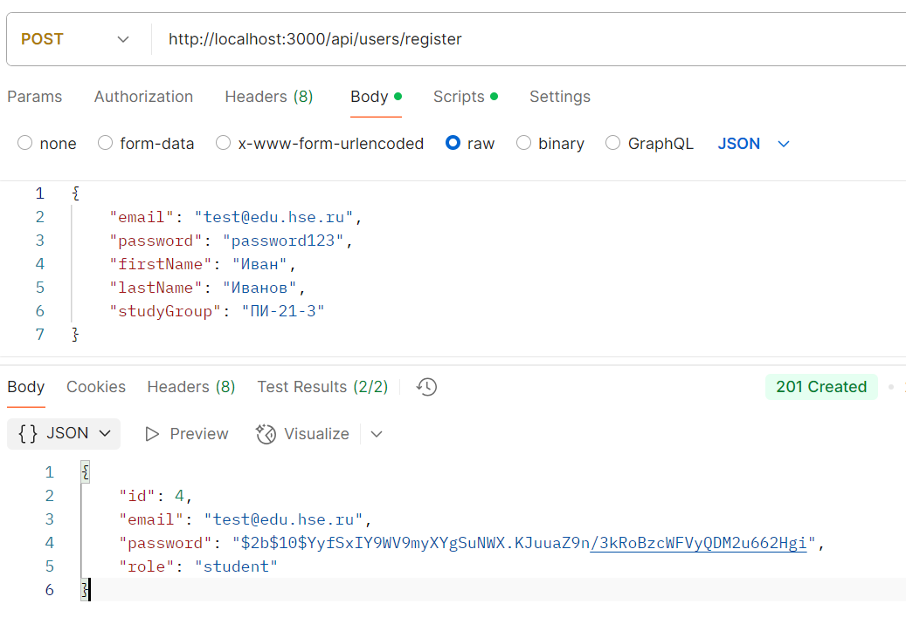

# Лабораторная работа №1
Требования реализованы и опубликованы в https://github.com/AnnaSpirina/ddss/tree/main/lab1

## 1. Подключение async-runtime к DSS
**Реализация:**
- Использованы современные асинхронные возможности Node.js (async/await)
- Все обращения к БД и внешним сервисам выполнены асинхронно
- Для работы с async/await добавлен babel-plugin-transform-runtime в конфигурацию сборки.
```
//Пример в UserRepository
async findByEmail(email) {
    const query = 'SELECT * FROM users WHERE email = $1';
    const values = [email];
    const result = await pool.query(query, values);
    return result.rows[0] ? new User(result.rows[0]) : null;
}
```

## 2. Подключение СУБД PostgreSQL к DSS
**Реализация:**
- Настроен пул соединений в `infrastructure/db/pool.js`
```
const { Pool } = require('pg');

const pool = new Pool({
    host: process.env.DB_HOST,
    port: process.env.DB_PORT,
    user: process.env.DB_USER,
    password: process.env.DB_PASSWORD,
    database: process.env.DB_NAME,
});
```
- Использованы миграции через `infrastructure/db/schema.sql`
- Подключение через environment variables
```
DB_HOST=localhost
DB_PORT=5432
DB_USER=postgres
DB_PASSWORD=postgreSQL
DB_NAME=student_org_db
PORT=3000
JWT_SECRET=secret
```
- Healthcheck в docker-compose
```
healthcheck:
    test: ["CMD-SHELL", "pg_isready -U postgres"]
    interval: 5s
    timeout: 5s
    retries: 5
```
- Автоматическое применение миграций при старте
```
"scripts": {
    "start": "node src/server.js",
    "dev": "nodemon src/server.js",
    "test": "jest --detectOpenHandles",
    "migrate": "psql -h localhost -U postgres -d student_org_db -f src/infrastructure/db/schema.sql"
  },
```


## 3. Четкое разделение слоев
1. **Интерфейс (API Endpoints)**

- Фреймворк: Express.js

- Расположение: `interfaces/`

2. **Application Layer**

- Преобразует DTO ↔ Domain Objects

- Расположение: `application/services/`

3. **Domain Layer**

- Содержит бизнес-логику

- Расположение: `domain/models/`

4. **Infrastructure Layer**

- Реализация репозиториев и внешних сервисов

- Расположение: `infrastructure/`

5. **Util Layer**
- Вспомогательные функции

- Расположение: `util/`

## 4. Тестирование
Разработаны интеграционные тесты
`tests/user.test.js`
`tests/organization.test.js`
`tests/event.test.js`

Они проверяют взаимодействие API с PostgreSQL и работу цепочки: Запрос → Контроллер → Сервис → Репозиторий → БД

## 5. Docker-инфраструктура
**Dockerfile**
```
FROM node:16-alpine
WORKDIR /app
COPY . .
RUN npm install
EXPOSE 3000
CMD ["npm", "start"]
```
**docker-compose.yml**
```
services:
  postgres:
    image: postgres:13
    environment:
      POSTGRES_USER: postgres
      POSTGRES_PASSWORD: postgreSQL
      POSTGRES_DB: student_org_db
    ports:
      - "5432:5432"
    volumes:
      - postgres_data:/var/lib/postgresql/data
      - ./infrastructure/db:/docker-entrypoint-initdb.d
    healthcheck:
      test: ["CMD-SHELL", "pg_isready -U postgres"]
      interval: 5s
      timeout: 5s
      retries: 5

  app:
    build: .
    ports:
      - "3000:3000"
    environment:
      DB_HOST: postgres
      DB_PORT: 5432
      DB_USER: postgres
      DB_PASSWORD: postgreSQL
      DB_NAME: student_org_db
      JWT_SECRET: secret
    depends_on:
      postgres:
        condition: service_healthy

volumes:
  postgres_data:
```

## Запуск проекта через Docker
```
docker-compose up  
[+] Running 3/3
 ✔ Network student-org_default       Created                                                                           0.0s 
 ✔ Container student-org-postgres-1  Created                                                                           0.1s 
 ✔ Container student-org-app-1       Created                                                                           0.1s 
Attaching to app-1, postgres-1
postgres-1  |
postgres-1  | PostgreSQL Database directory appears to contain a database; Skipping initialization
postgres-1  |
postgres-1  | 2025-03-28 21:34:46.609 UTC [1] LOG:  starting PostgreSQL 13.20 (Debian 13.20-1.pgdg120+1) on x86_64-pc-linux-gnu, compiled by gcc (Debian 12.2.0-14) 12.2.0, 64-bit
postgres-1  | 2025-03-28 21:34:46.610 UTC [1] LOG:  listening on IPv4 address "0.0.0.0", port 5432
postgres-1  | 2025-03-28 21:34:46.611 UTC [1] LOG:  listening on IPv6 address "::", port 5432
postgres-1  | 2025-03-28 21:34:46.616 UTC [1] LOG:  listening on Unix socket "/var/run/postgresql/.s.PGSQL.5432"
postgres-1  | 2025-03-28 21:34:46.625 UTC [28] LOG:  database system was shut down at 2025-03-28 21:34:40 UTC
postgres-1  | 2025-03-28 21:34:46.637 UTC [1] LOG:  database system is ready to accept connections
app-1       |
app-1       | > student-org@1.0.0 start
app-1       | > node src/server.js
app-1       |
app-1       | Successfully connected to database
app-1       | Server is running on port 3000
```

## Тестирование функций через Postman
Регистрация пользователя

Успешный вход в систему

Вход с неверным паролем

Вход несуществующего пользователя

Успешное создание студорганизации (авторизованный администратор)

Создание студорганизации обычным студентом

Создание мероприятия

...


## Ключевые архитектурные решения
1. Отказ от CQRS: Система имеет умеренную нагрузку и сложность, поэтому достаточно синхронного взаимодействия между слоями.
2. Используется преобразование Domain → DTO на уровне Application.
3. Присутствуют чёткие границы между компонентами, зависимости направлены внутрь (от интерфейсов к домену).
4. Применяются асинхронные вызовы.